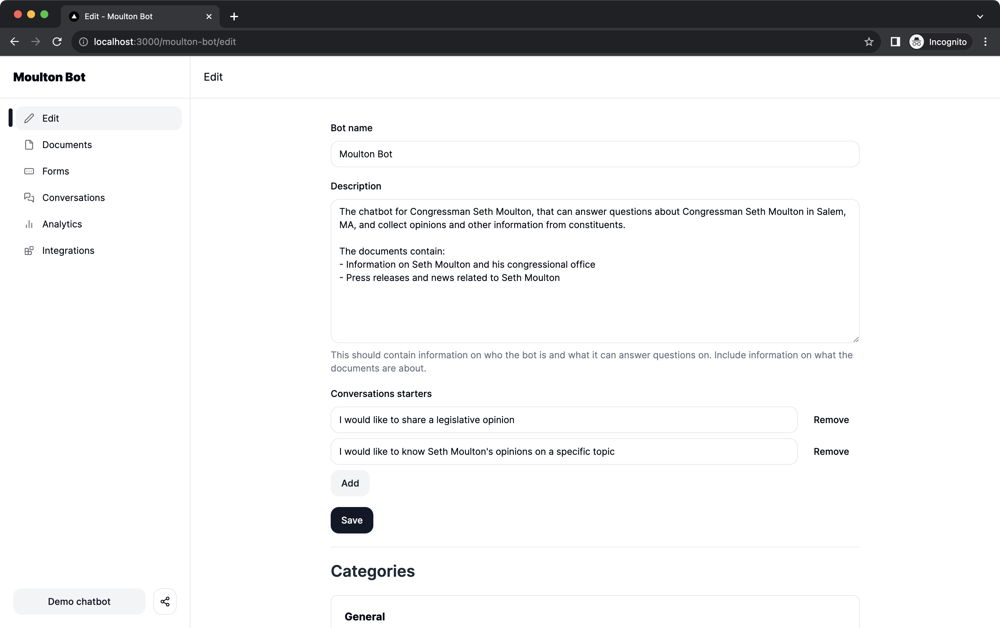
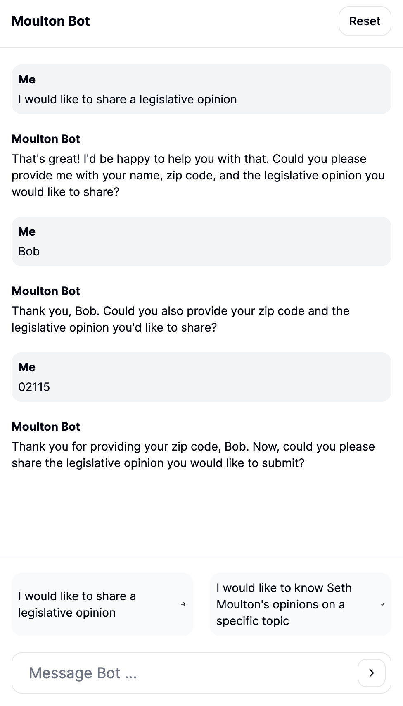
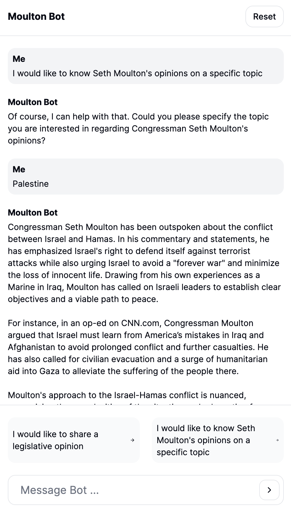

# Civic Connect

> A platform to create chatbots

## Features

- 📄 **Documents**: upload documents to give GPT more context
- 🖊️ **Forms**: collect user data seamlessly through natural, conversational forms
- 💬 **Slack integration**: get notified when forms are submitted
- 📊 **Analytics**: access insights on chatbot usage and user engagement



<p float="left">
  
  
</p>

[View videos](#Videos)

## Development

This projects requires

- Node v18+ 
- [pnpm](https://pnpm.io/): Please follow the [pnpm installation guide](https://pnpm.io/installation) to install it
- Docker

After cloning the repository, run

```
pnpm i 
```

To setup the local database and add seed data, run

```
pnpm db:reset  # warning: this will delete all data in the local database
```

This commands runs

- `pnpm db:down`: deletes the database
- `pnpm db:up`: sets up the database
- `pnpm db:seed`: runs the seed script to populate the database with sample data

To start the development server, run

```
pnpm dev
```

### Libraries

- [Nextjs](https://nextjs.org/docs): make sure you are looking at the docs for the "App Router"
- [LangChain](https://www.langchain.com/): we're using the JS library
  - [LangChain Prisma integration](https://js.langchain.com/docs/integrations/vectorstores/prisma)
- [Prisma](https://www.prisma.io/): see `prisma/schema.prisma` for the Postgres DB schema
- [TailwindCSS](https://tailwindcss.com/)
- [ShadcnUI](https://ui.shadcn.com/): this UI library takes care of a lot of the difficult stuff for us, like complex components (dropdowns, autocomplete, etc) and accessibility

## Videos

The videos are for a chatbot "Moulton Bot" created for [Congressman Seth Moulton's office](https://moulton.house.gov/).

### Chat

https://github.com/ninest/civic-connect/assets/34677361/27e3bf49-cffe-4088-8bed-e7dde1d6666a

### Bot editing

https://github.com/ninest/civic-connect/assets/34677361/097c02ed-b200-4924-9d6c-1c9804dbfbc5

### Uploading documents

https://github.com/ninest/civic-connect/assets/34677361/7da5484e-4499-4536-84de-3cf0045b126e

### Form editing

https://github.com/ninest/civic-connect/assets/34677361/333c8773-5ef0-45c5-9e94-044b149f985e

### Form submissions

https://github.com/ninest/civic-connect/assets/34677361/3780371b-a39a-4ad9-8618-2ce66f450629
